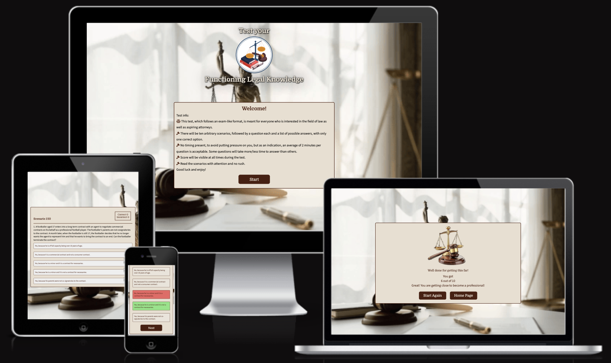
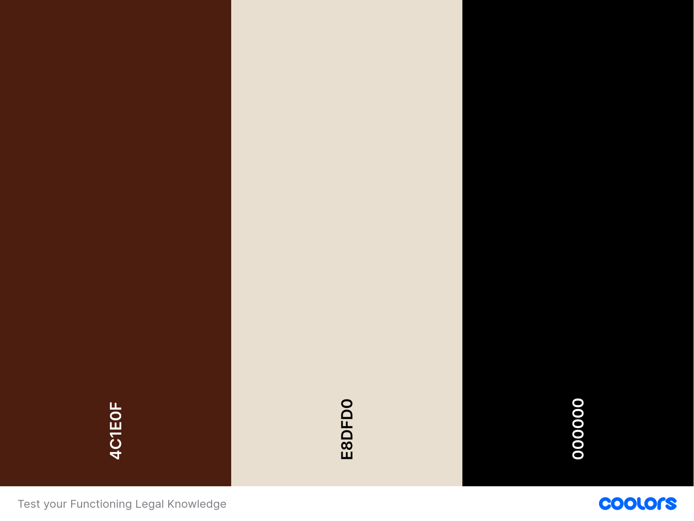
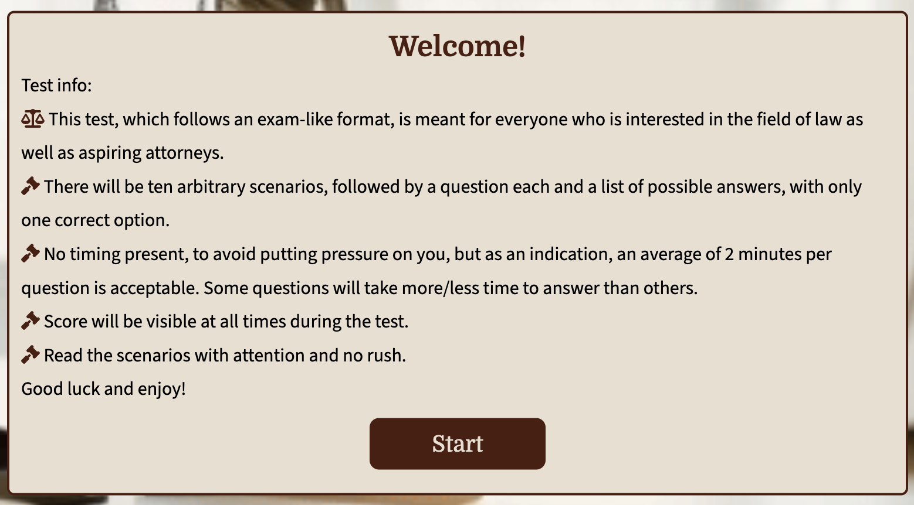
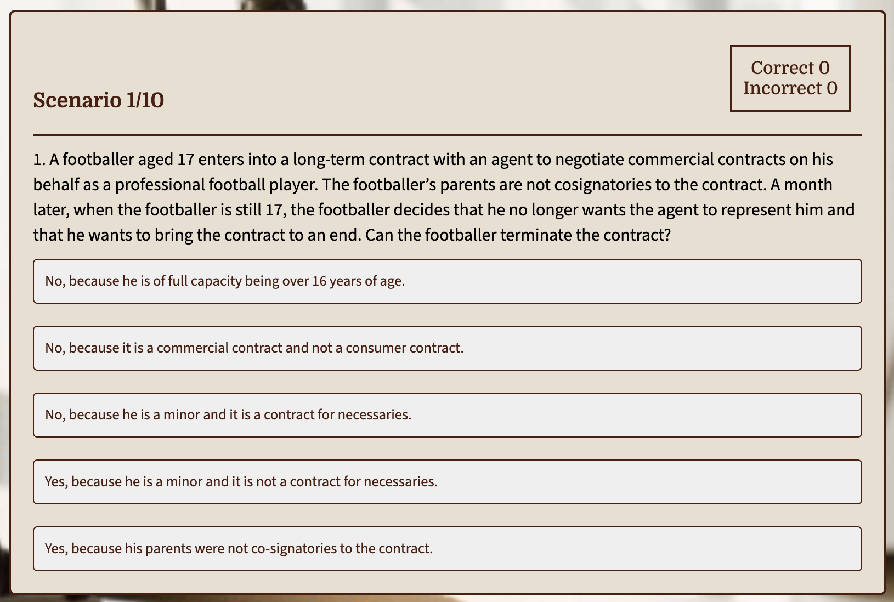
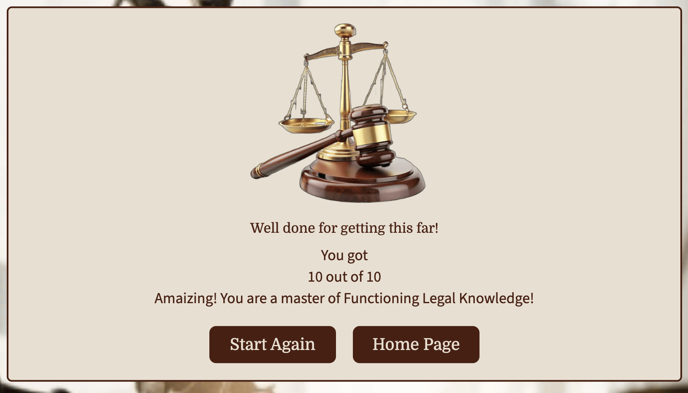
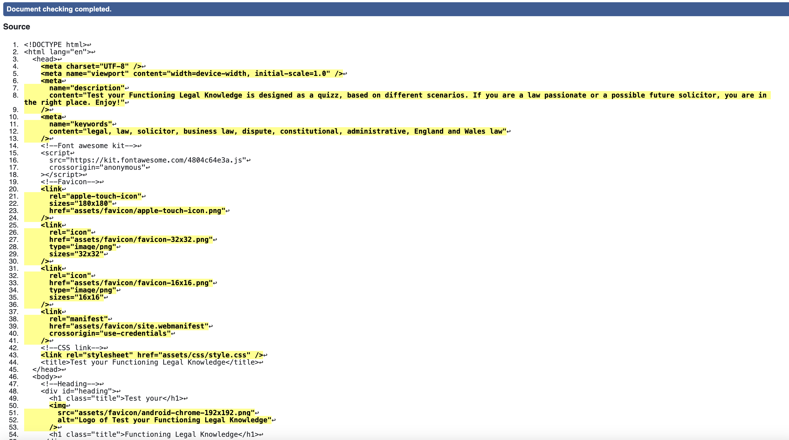
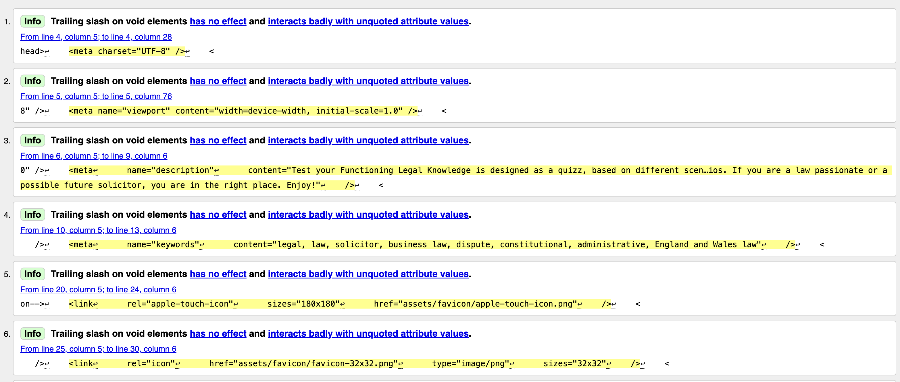
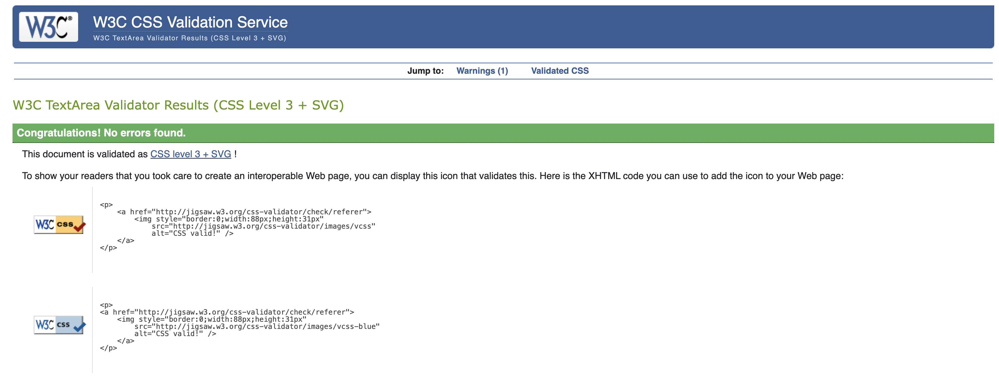
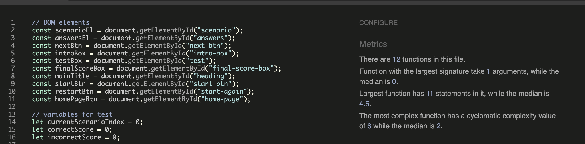
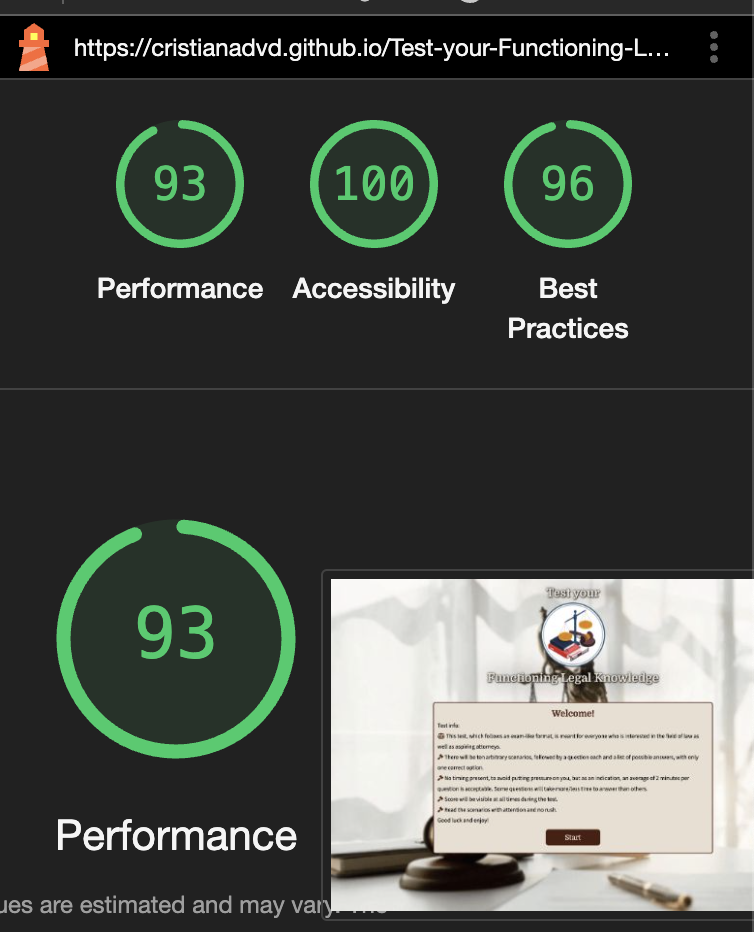

# Test your Functioning Legal Knowledge

The Test your Functioning Legal Knowledge was created for all law enthusiasts and aspiring attorneys. It was created to be responsive and offer a good User Experience.

## [See Test your Functioning Legal Knowledge on Github pages](https://cristianadvd.github.io/Test-your-Functioning-Legal-Knowledge/)

## Contents 

- [User Experience]
 
   -[External user's goals]

- [Design]
   - [Colour scheme]
   - [Typography]
   - [Imagery]

- [Features]
   - [Main title and Logo]
   - [Intro box]
   - [Test box]
   - [Final score box]
   - [404 Error page]   
   - [Features to be implemented]   

- [Accessibility]   

- [Languages used]
   - [Frameworks, Libraries & Programs Used]

- [Deployment & Local Development]

- [Testing] 
   - [Solved bugs]
   - [W3C Validator for HTML and CSS]
   - [JSHint for JavaScript]   
   - [Lighthouse]
   - [Full testing]

- [Credits]   

--- 

## User Experience 

Test your Functioning Legal Knowledge is an excellent option for law passionate or future attorneys, to test their legal knowledge, in areas like Business Law and Practice, Dispute Resolution, Constitutional and Administrative Law and EU Law and Legal Services, Criminal Law and Practice, Trusts, Wills and the Administration of Estates, Solicitors Accounts.

### External user's goals

 - The users are interested in testing their legal knowldge in the area specified.
 - The users are looking for an easy interaction in starting the test and choosing the answers.
 - The users are expecting to see their score at all times and the final one.

## Design

### Colour Scheme 

A colour palette was used to match the background imgage and teh colour of the most used object in the fields of law. The colour palette was created using the [Coolors](https://coolors.co/) website.

### Typography 

- Google Fonts was used for the following fonts:
 
  - Domine that is a serif font was used for titles and buttons.
  - Source Sans 3 is a sans-serif font and was used for the paragraphs and answer buttons.

### Imagery

All images used for creating this test are credited in the [credits](#Credits) section.

## Features 

This test is comprised of 3 boxes (intro box, test box and final score box) and a 404 Error page.

### Main title and Logo

The main title and Logo are only visible before starting the test. Logo chosen in accordance with the theme and purpose of the test. Credits to be seen [here](#Credits).

### Intro box

- The intro box offers the basic information about the test. Icons as gavel and scale balance were used to increase interest. 
- Also, the start button to get the test started.

### Test box 

- The test box is comprised of a heading showing the current scenario number on the left-hand side, and on the right-hand side the number of correct and incorrect answers live. 
- The section is comprised of scenario text and questions to be answered, and five buttons with possible answers. 
- The correct and incorrect answers are background coloured accordingly (didn't include a screenshot to not encourage cheating).
- After an answer is clicked the Next button appears to continue the test.

### Final Score box 

Final score box is presenting the final number of correct answers out of the total number. There is also an ecouraging/congrats message for all stages.

### 404 Error page 

To create a better interaction for the users, a personalised 404 Error page was created, to be opened when they encounter broken links or land on a page that doesn't exists.

### Features to be implemented 

- More scenarios to be introduced.
- More than one options of correct answers.
- A feature to request users details in order to keep their score recorded.

## Accessibility 

I made sure the website was as accessible as possible during the development phase. I have done this by:
 - Assuring a good colour contrast throught the test.
 - Using descriptive alt attributes on images used.

--- 

## Languages Used

This development was created with HTML, CSS and JavaScript.

### Frameworks, Libraries & Programs Used

VS Code - For version control.

Github - To save and store the files.

Google Fonts - To import the fonts used on the website.

Font Awesome - For the iconography on the website.

Google Dev Tools - To troubleshoot and test features, solve issues with responsiveness and styling.

[Favicon.io](https://favicon.io/) To create favicon.

[Am I Responsive?](http://ami.responsivedesign.is/) To show the test image on a range of devices.

--- 

## Deployment

Github Pages was used to deploy the live site. The instructions to achieve this are below:

1. Log in (or sign up) to Github.
2. Find the repository for this project, Test your Functioning Legal Knowledge.
3. Click on the Settings link.
4. Click on the Pages link in the left hand side navigation bar.
5. In the Source section, choose main from the drop down select branch menu. Select Root from the drop down select folder menu.
6. Click Save. Your live Github Pages site is now deployed at the URL shown.

## Testing 

Every step of the development process was subject to ongoing testing.  Throughout the development process, I used the Chrome developer tools to find and address any issues.

### Solved bugs
 
  - Start button would not work as per js function. Changed class name into id and changed js variable and worked.
  - Boxes would not show and hide accordingly. I was not using the class hide correctly. Issue fixed.
  - The a attribute with button role on 404 page would not centre. Used Dev tools to find best option to centre it. Fixed it.

### W3C Validator for HTML and CSS  

- The [W3C](https://validator.w3.org/nu/) validator was used to validate the HTML and CSS.

- No errors shown after validating the HTML code, only info due to closing tab as used Prettier to format all the files.

- Also no errors after validating the CSS code.

### JSHint for JavaScript 

- The [JSHint](https://jshint.com/) validator was used to check and validate the JavaScript code.
- No errors present.

### Lighthouse

I used Lighthouse within the Chrome Developer Tools to allow me to test the performance, accessibility and best practices of the website.

### Full testing

I went through each box using google chrome developer tools to ensure that they responsive on all different screen sizes.

All buttons work correctly and lead to the correct path as per JS code.

## Credits

- Scenarios and answers link source [here](https://sqe.sra.org.uk/docs/default-source/pdfs/sqe1-flk1-sample-questions-updated-feb-2024.pdf?sfvrsn=5117ba1b_5)
- Inspiration links on how to create a quiz type test:
  1. Credits to [sitepoint](https://www.sitepoint.com/simple-javascript-quiz/)
  2. Credits to [GreatStack](https://www.youtube.com/watch?v=PBcqGxrr9g8)
- Code to create a bordered written title found [here](https://developer.mozilla.org/en-US/docs/Web/CSS/text-shadow)
- Background image found [here](https://www.google.com/url?sa=i&url=https%3A%2F%2Fwww.proprofs.com%2Fquiz-school%2Fstory.php%3Ftitle%3Dlrw-legal-analysis-introduction&psig=AOvVaw2QvljPJtmlezEBsJSIlqer&ust=1740164176885000&source=images&cd=vfe&opi=89978449&ved=0CBQQjRxqFwoT)
- [Logo image](https://www.google.com/url?sa=i&url=https%3A%2F%2Feduadvisor.my%2Fquiz%2Flaw-career-quiz&psig=AOvVaw1oJ7HFo11a1yN7axS5kMB2&ust=1740591110228000&source=images&cd=vfe&opi=89978449&ved=0CBQQjRxqFwoTCOCMt6yt34sDFQAAAAAdAAAAABAE)
- [Final score box image](https://www.freepik.es/psd-premium/tabla-leyes-aislada-sobre-fondo-transparente_292134894.htm)